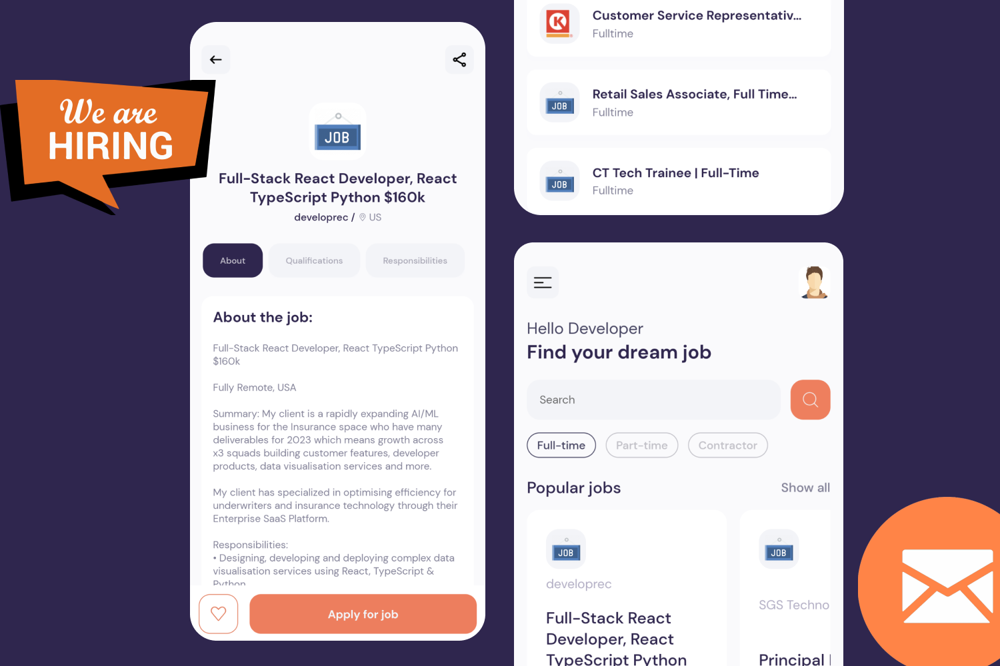

# JobSearch App

The Mobile Job Searching App is a cross-platform application designed to help users search and apply for jobs through their mobile devices. The app is available for both iOS and Android platforms, providing a user-friendly interface to help job seekers find job opportunities that match their skills and experience.

## Features

* **Job Search**: Users can search for jobs based on various criteria such as job title, location, company. The app also allows users to filter jobs by job type.

* **Job Application**: The app provides users with a simple and easy way to apply for jobs.


## Set-up

To use the Mobile JobSearch App, download the code and open terminal in the directory. 
Type 
```sh
npx create-expo-app@latest --example with-router
```
then run by typing 
```sh
expo-cli start --tunnel
```
if this doen't work, run ```sh Set-ExecutionPolicy -Scope Process -ExecutionPolicy Bypass``` then run the previous command.

Once you run this, give it a few min. After that a QR code and a URL will be appear.

Download Expo Go from App Store or Play Store. Scan the QR code or Type the URL.

This may take few minutes.

if you see this following window


congratulations!!!


## Support

If you encounter any issues contact me at https://aritrasarkar.tech/.
